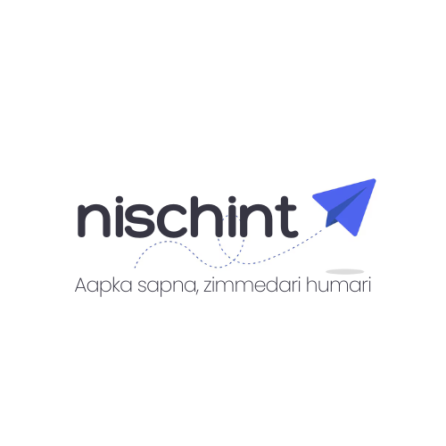

# Nischint - Financial Personality Assessment Assistant

<div align="center">



**A modern web application that provides personalized financial assessments through an adaptive questionnaire system**

[](https://vercel.com/new/clone?repository-url=https://github.com/EntroproxTheOne/nishchint)

</div>

The application analyzes user responses to create comprehensive financial profiles and insights.

## Overview

> Why does financial advice always fail gig workers? It ignores **volatility**. This project's core is a "Foresight Engine" for an AI agent that embraces it. Instead of a single bad guess, it provides a **statistically guaranteed 90% "surity" range** for your income and expenses. It's the brain for an agent that *actually* helps you budget for uncertainty.
>
> **[See the full model trained from scratch in Google Colab!](https://colab.research.google.com/drive/1Es5Sg0MJ-fuNrRniCJbYPb341s-feDic?usp=sharing)**

Nischint is the web application that uses this engine to provide a personalized financial assessment. It combines foundational questions with dynamically generated follow-up questions to create a comprehensive financial profile, all powered by advanced language processing.

## Features

- **Adaptive Question System**: 5 foundational questions + 20 dynamically generated personalized questions
- **Intelligent Analysis**: Uses advanced language processing to generate contextual questions and summaries
- **Session Management**: Tracks user progress across question batches
- **Fallback System**: Continues working even if external services are unavailable
- **Modern Interface**: Clean design with dark/light theme support and smooth animations
- **Resizable Interface**: Fully resizable components for optimal user experience
- **Type Safety**: Built with TypeScript for robust development

## Technology Stack

### Frontend
- **React 19.2.0** with TypeScript
- **Vite** for fast development and building
- **Tailwind CSS** for styling
- **Framer Motion** for animations
- **jsPDF** for report generation

### External Services
- **Google Gemini** for question generation and analysis
- **React Markdown** for content rendering

## Quick Start

### Prerequisites
- Node.js (v16 or higher)
- npm or yarn
- Google Gemini API key

### Installation

1. **Clone the repository**
```bash
git clone https://github.com/EntroproxTheOne/nishchint.git
cd nischint
```

2. **Install dependencies**
```bash
npm install
```

3. **Set up environment variables**
Create a `.env` file in the root directory:
```
GEMINI_API_KEY=your_gemini_api_key_here
```

4. **Start the application**
```bash
npm run dev
```

The application will be available at `http://localhost:3000`

## How It Works

### Question Flow

1. **Foundation Questions**: 5 predefined questions covering core financial areas:
   - Spending priorities
   - Risk tolerance
   - Financial planning approach
   - Goal horizon
   - Money emotions

2. **Dynamic Questions**: 20 questions dynamically generated based on:
   - User's previous answers
   - Age and demographic information
   - Emerging financial patterns
   - Areas needing deeper exploration

3. **Summary Generation**: Personalized financial personality summary with insights and recommendations

### Fallback System

If external services are unavailable:
- The system automatically uses pre-written fallback questions
- User experience remains seamless
- No errors are shown to the end user

## Available Scripts

```bash
# Development
npm run dev              # Start development server
npm run build            # Build for production
npm run preview          # Preview production build
```

## Project Structure

```
nischint/
├── components/              # React components
│   ├── LandingPage.tsx     # Welcome screen
│   ├── QuestionFlow.tsx    # Dynamic question engine
│   ├── SummaryPage.tsx     # Results and PDF export
│   └── ui/                 # Reusable UI components
├── services/               # External service integrations
│   ├── geminiService.ts    # Language processing integration
│   └── akinatorEngine.ts   # Legacy rule-based engine
├── types.ts                # TypeScript type definitions
├── constants.ts            # Application constants
├── App.tsx                 # Main application component
└── package.json            # Dependencies and scripts
```

## Configuration

### Environment Variables

| Variable | Description | Required | Default |
|----------|-------------|----------|---------|
| GEMINI_API_KEY | Google Gemini API key | Yes | - |

## Features

### User Experience
- **Responsive Design**: Works on desktop and mobile devices
- **Theme Support**: Light/dark mode with system preference detection
- **Progress Tracking**: Visual progress bar throughout assessment
- **Smooth Animations**: Professional slide transitions
- **Accessibility**: Keyboard navigation support
- **Resizable Interface**: All components can be resized to user preference

### Analysis Capabilities
- **Dynamic Question Generation**: Questions adapt based on user responses
- **Contextual Analysis**: Considers all previous answers for next questions
- **Personality Profiling**: Creates unique financial personality types
- **Professional Summaries**: Formatted insights with actionable advice

### Export Functionality
- **PDF Generation**: Complete profile with summary, key insights, and raw data
- **Professional Formatting**: Clean, branded PDF layout

## Security

- API keys stored in environment variables (never committed)
- Environment variables not exposed to frontend
- Input validation on all user interactions
- Error handling with fallback systems

## Performance

- **Foundation Questions**: < 100ms (no external API call)
- **Dynamic Questions**: 1-3s each (external API)
- **Summary Generation**: 2-4s (external API)
- **Total Assessment Time**: Approximately 3 minutes
- **API Calls per User**: 5 total

## Contributing

1. Fork the repository
2. Create a feature branch (`git checkout -b feature/amazing-feature`)
3. Commit your changes (`git commit -m 'Add amazing feature'`)
4. Push to the branch (`git push origin feature/amazing-feature`)
5. Open a Pull Request

## License

This project is licensed under the MIT License.

## Acknowledgments

- Google Gemini for powering the intelligent question generation
- React and Vite communities for excellent tooling
- Tailwind CSS for the utility-first CSS framework

---

**Built for better financial understanding**
